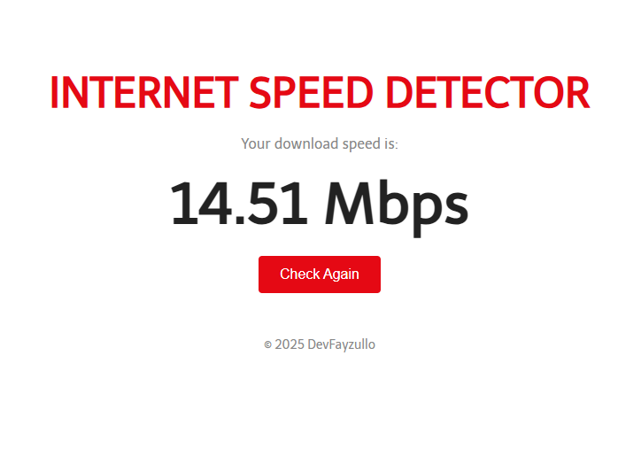

# ⚡️ Fast Speed Test

A minimalist internet speed test app inspired by **Fast.com**, built with HTML, CSS, and JavaScript.  
It measures **real-time download speed** by downloading an image and calculating transfer rate in Mbps.

---

## 🚀 Features

- 🔍 Measures **real download speed (Mbps)**
- 🧠 Uses actual image download for precise calculation
- 🎯 Minimalist and responsive design
- 🧩 Built with pure **HTML + CSS + JS** (no libraries)

---

## 📸 Preview

> 

---

## 🧪 How It Works

1. Downloads a small test image (~350 KB)
2. Measures the time taken to fully load the image
3. Calculates speed using the formula:  
   `Speed (Mbps) = (ImageSize * 8) / timeInSeconds / 1024 / 1024`

---

## 📂 Folder Structure

```
fast-speed-test/
├── index.html       # App structure
├── style.css        # UI styling
├── script.js        # Speed test logic
├── notes.md         # Developer notes & ideas
├── screenshot.png   # Screnshot
└── README.md        # Project description
```

---

## 🛠 Tech Stack

- HTML5
- CSS3
- JavaScript (Image object, `onload`, timing logic)

---

## 📦 Getting Started

1. Clone the repository:

```bash
git clone https://github.com/yourusername/fast-speed-test.git
```

2. Open `index.html` in your browser.

✅ No installation needed – fully client-side and ready to use.

---

## 🌐 Live Demo

(https://internet-speed-detector.netlify.app/)

---

## 📄 License

This project is open-source under the **MIT License**.

---

## 🧑‍💻 Author

Built with ❤️ by [DevFayzullo](https://github.com/DevFayzullo).

---

Happy coding! 🚀
