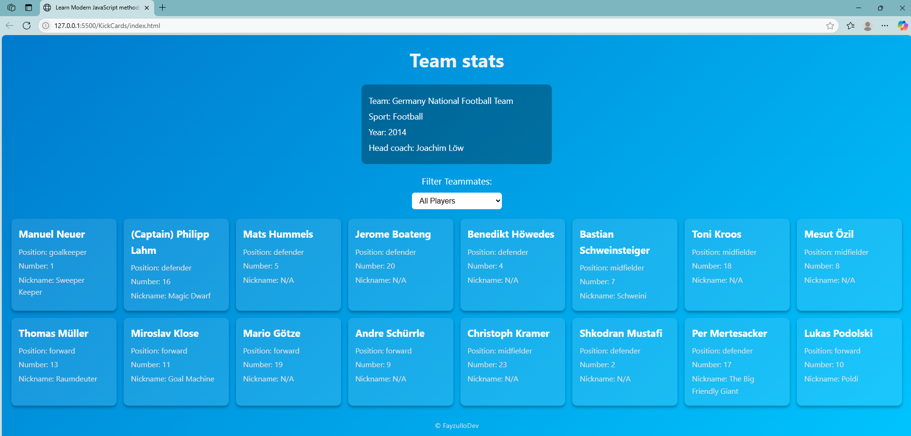

# KickCards 🃏⚽️

Learn modern JavaScript by building and filtering **Germany Football Team cards** dynamically.

This project helps you practice:
- DOM manipulation
- Object destructuring and immutability
- Array filtering and rendering
- Clean HTML/CSS/JS structure
- Responsive design using CSS Grid

---

## 🚀 Features

✅ Displays Germany 2014 World Cup-winning squad dynamically  
✅ Filter players by position and nickname  
✅ Glassmorphism cards with hover animations  
✅ Linear-gradient background for a clean aesthetic  
✅ Beginner-friendly, fully functional JavaScript practice project

---

## 🛠 Tech Stack

- **HTML5** – Semantic structure
- **CSS3** – Responsive grid, glassmorphism, gradient backgrounds
- **Vanilla JavaScript** – No frameworks, focusing on clean modern syntax

---

## 📸 Preview

 <!-- Add a screenshot if you wish -->

---

## ⚡️ Getting Started

1️⃣ **Clone this repository:**

```bash
git clone https://github.com/DevFayzullo/kickcards.git
cd kickcards
```

2️⃣ **Open `index.html` in your browser.**

No dependencies, no build step – everything runs locally.

---

## 📝 Learning Goals

- Practice filtering data arrays dynamically with `select` dropdowns.
- Understand event handling and DOM updates.
- Learn clean, organized folder structure for JavaScript projects.
- Style UI components with modern CSS.

---

## 📂 Folder Structure

```
kickcards/
│
├── img/screenshot.png
├── index.html
├── styles.css
└── script.js
```

---

## 🤝 Contributing

If you want to improve or extend this project (e.g., adding player images, dark mode, or React version), feel free to fork and open a pull request.

---

## 📄 License

This project is open-source under the **MIT License**.

---

## 🧑‍💻 Author

Built with ❤️ by [Your Name](https://github.com/DevFayzullo).

---

Happy coding! 🚀
