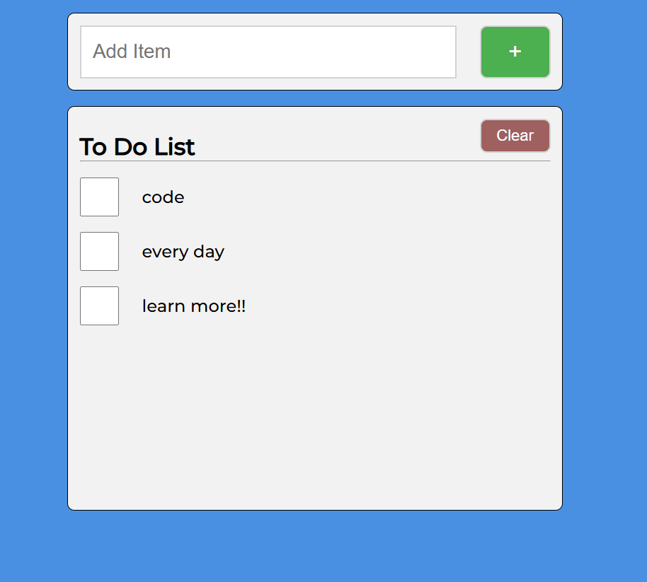

# 📝 To-Do List App

A simple and clean **To-Do List** web application built using **HTML, CSS (Sass)**, and **Vanilla JavaScript (ES6 Modules)**.

---

## 📸 Screenshot



---

## ⚙️ Features

- ✅ Add new to-do items
- ✅ Remove completed items by clicking checkboxes
- ✅ Clear the entire list with one click
- ✅ Items are saved in **localStorage**
- ✅ Accessible and keyboard-navigable

---

## 🧹 Folder Structure

```
To-Do-List/
│
├── index.html
├── README.md
├── js/
│   ├── main.js
│   ├── todolist.js
│   └── todoitem.js
├── sass/
│   └── style.css
└── screenshot.png
```

---

## 🚀 Getting Started

### 1. Clone this repository or download the ZIP

```bash
git clone https://github.com/yourusername/To-Do-List.git
```

### 2. Open the project in your browser

> Simply open `index.html` with Live Server (VSCode extension) or any modern browser.

---

## 💠 Technologies Used

- HTML5
- CSS3 (compiled from Sass)
- Vanilla JavaScript (ES6 Modules)
- LocalStorage for data persistence

---

## 🧪 Known Issues

- No backend integration yet
- No drag-and-drop sorting
- Refresh clears screen reader alert (`aria-live`)

---

## 📄 License

This project is open-source and available under the [MIT License](LICENSE).

---

## ✍️ Author

Made with ❤️ by \[DevFayzullo]
