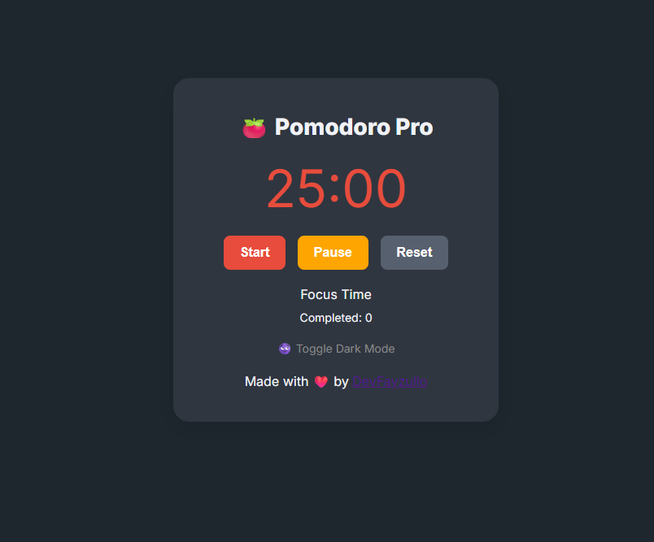

# 🍅 Pomodoro Timer Pro

A premium, responsive Pomodoro Timer app built with HTML, CSS, and JavaScript.
It helps you manage your focus and break sessions using the proven 25/5/15 technique.

---

## 📌 Features

✅ 25-minute focus ⏱️ + 5-minute short break ✨
✅ 4 cycles → 15-minute long break ☕
✅ Audio alert on session end 🔔
✅ Dark mode toggle 🌙
✅ Pomodoro session count saved via `localStorage` 📊
✅ Responsive, mobile-friendly design 📱
✅ Clean, modern, premium UI

---

## 💽 Demo

 

---

## 🚀 How to Run

Clone the repository:

```bash
git clone https://github.com/DevFayzullo/js-projects.git
cd js-projects/pomodoroTimerPro
```

Then simply open the `index.html` file in your browser, or use **Live Server** in VS Code.

---

## 🧐 Learning Highlights

* `setInterval`, `clearInterval` for time control
* DOM manipulation and event handling
* Audio playback using `<audio>`
* Data persistence with `localStorage`
* Responsive layout with media queries
* Theme toggle (light/dark mode)

---

## 📂 File Structure

```
pomodoroTimerPro/
├── index.html
├── style.css        # (integrated inside index.html, optional to split)
├── script.js        # (integrated inside index.html, optional to split)
└── screenshot.png   # Demo image (add one)
```

---

## 📄 License

This project is open-source under the [MIT License](https://opensource.org/licenses/MIT).

---

## 👨‍💻 Author

Created with ❤️ by [DevFayzullo](https://github.com/DevFayzullo)

> “Discipline is the bridge between goals and accomplishment.” – Jim Rohn

---

Happy focusing! 🔥
