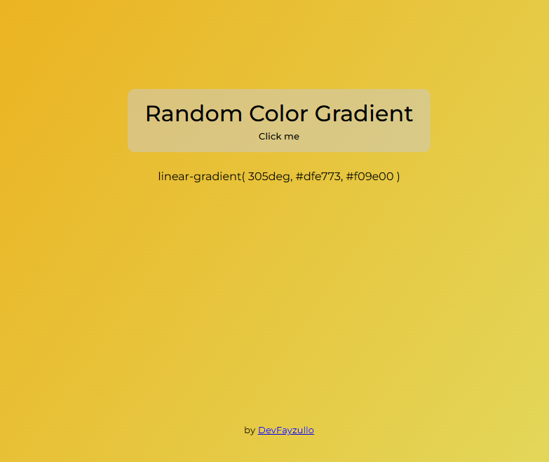

# 🎨 Random Gradient Background Generator

A simple JavaScript project that generates a random linear-gradient background with every click. It also displays the current gradient CSS string on the page.

---

## 🚀 Features

- Generates two random HEX colors.
- Applies a random gradient angle (0°–360°).
- Updates the background of the body.
- Shows the exact `linear-gradient(...)` used.

---

## 🖥️ Demo

Click anywhere inside the container to generate a new background!



---

## 📁 Project Structure

```
randomColorGradient/
├── index.html        # Main HTML structure
├── style.css         # Styling with default gradient
├── app.js            # JavaScript logic for gradient generation
├── screenshot.png    # Screnshot
└── README.md         # Project description
```

---

## 🔧 Technologies

- HTML5
- CSS3
- Vanilla JavaScript

---

## 🧪 How It Works

1. Random HEX color is generated using `getGradient()`.
2. `setGradient()` combines two colors and a random degree.
3. The body background is updated with the new gradient.
4. The gradient CSS string is displayed in `<p id="color-text">`.

---

## 📦 Getting Started

1. Clone the repository:

```bash
git clone https://github.com/DevFayzullo/randomColoGradient.git
```

2. Open `index.html` in your browser.

✅ No installation needed – fully client-side and ready to use.

---

## 🌐 Live Demo

👉 [Click here to view the live demo](https://randomcolorgradient.netlify.app/)

---

## 📄 License

This project is open-source under the **MIT License**.

---

## 🧑‍💻 Author

Built with ❤️ by [DevFayzullo](https://github.com/DevFayzullo).

---

Happy coding! 🚀
