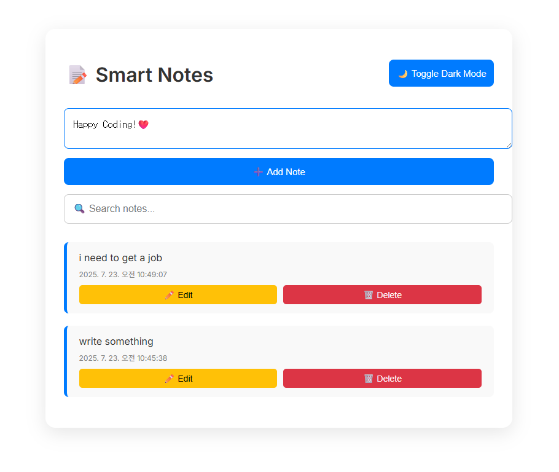

# 📝 Smart Notes App

A polished, responsive Notes App built with HTML, CSS, and JavaScript — designed for quick thoughts, reminders, and personal journaling. All notes are stored locally, offering a secure, offline-first experience.

---

## 📌 Features

✅ Add, edit, and delete notes effortlessly
✅ Real-time search filtering 🔍
✅ Auto-saved timestamps 🕒
✅ Dark mode toggle 🌙 (saved in `localStorage`)
✅ Fully responsive layout for all devices 📱
✅ Persistent note storage via `localStorage` 💾
✅ Clean, elegant, and accessible UI

---

## 💽 Demo



---

## 🚀 How to Run

Clone the project:

```bash
git clone https://github.com/DevFayzullo/js-projects.git
cd js-projects/smartNotesApp
```

Then open `index.html` in your browser.
Or run with **Live Server** in VS Code for a smoother dev experience.

---

## 🧠 What You’ll Learn

- Efficient DOM manipulation and dynamic rendering
- CRUD operations with `localStorage`
- Dark mode implementation using CSS variables
- Mobile-first responsive design principles
- State management without frameworks
- Clean UI layout and user-friendly interactions

---

## 📂 File Structure

```
smartNotesApp/
├── index.html         # App layout
├── style.css          # Light/Dark styles
├── script.js          # App logic
├── screenshot.png     # Optional demo image
└── README.md          # Project description
```

---

## 🛠️ Future Improvements

- [ ] Note categories/tags
- [ ] Export to PDF or .txt
- [ ] PWA support (offline installable app)
- [ ] Cloud sync support
- [ ] Voice note feature

---

## 📄 License

This project is open-source under the [MIT License](https://opensource.org/licenses/MIT)

---

## 👨‍💻 Author

Built with care by [DevFayzullo](https://github.com/DevFayzullo)

> “Simplicity is the ultimate sophistication.” – Leonardo da Vinci

---

Stay organized. Stay focused. 💡
Save your thoughts before they disappear 🧠💾
