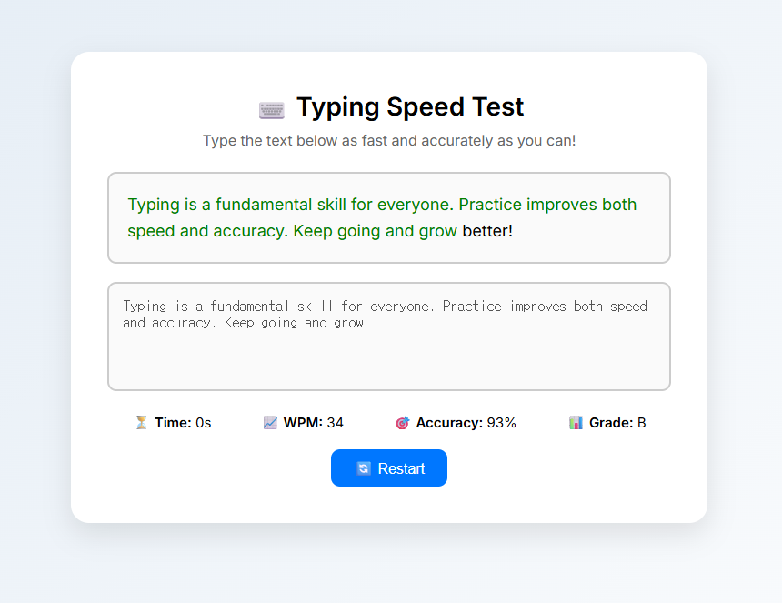

# ⌨️ Typing Speed Test

A responsive and interactive JavaScript project that lets you test your typing speed, accuracy, and performance. Just start typing and see real-time results — including **WPM (Words Per Minute)**, **accuracy (%)**, and a **performance grade (A–F)**. Perfect for improving typing skills with clean UI and immediate feedback.

---

## 🚀 Features

* ⏱️ 30-second countdown timer
* ✅ Character-by-character real-time correctness highlighting
* 🧠 Accuracy calculator and performance grade
* 📈 WPM (Words Per Minute) live update
* 💎 Premium responsive design with soft gradients and shadows

---

## 🖥️ Demo

Type the text in the textarea below to begin the test. Results update automatically!



---

## 📁 Project Structure

```
typingSpeedTest/
├── index.html        # Main HTML structure
├── style.css         # Premium UI design (responsive, styled)
├── script.js         # All typing logic and stats
├── screenshot.png    # Demo screenshot
└── README.md         # Project description
```

---

## 🔧 Technologies

* HTML5
* CSS3 (custom styling, Google Fonts)
* Vanilla JavaScript (ES6+)

---

## 🧪 How It Works

1. The user starts typing the displayed text.
2. The timer starts automatically on the first keystroke.
3. Each character typed is compared to the target and color-coded.
4. On timeout, the app calculates:

   * Total typed words
   * Correct character percentage (accuracy)
   * Final WPM
   * Grade (A–F) based on accuracy

---

## 📦 Getting Started

1. Clone the repository:

```bash
git clone https://github.com/DevFayzullo/typingSpeedTest.git
```

2. Open `index.html` in your browser.

✅ No setup required – fully client-side and ready to use!

---

## 🌐 Live Demo

👉 [Click here to try it live](https://typingspeedtest.netlify.app/) <!-- update if available -->

---

## 📄 License

This project is open-source under the **MIT License**.

---

## 👨‍💻 Author

Built with ❤️ by [DevFayzullo](https://github.com/DevFayzullo)

---

Happy typing! 🚀
